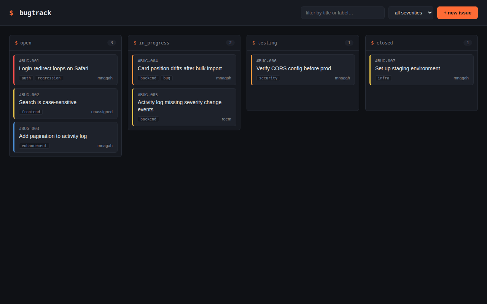

# Bug Tracker

[](https://github.com/Kazenubis/Bug-Tracker/actions/workflows/tests.yml)

A Kanban-style bug tracker for dev teams, built with Flask and vanilla JS — drag issues across Open, In Progress, Testing, and Closed, with a full audit trail of every change.



## Features

- Drag-and-drop board with 4 workflow columns, backed by a REST API
- Per-issue activity log — every status, severity, assignee, or label change is recorded with old → new value and a timestamp
- Live filtering by severity and free-text search across title and labels
- Severity-coded cards (critical / major / minor / trivial) with labels and assignee at a glance
- 22 backend tests covering CRUD, validation, and the reordering logic

## Tech Stack

Python 3 · Flask · Flask-SQLAlchemy · SQLite · vanilla JavaScript · SortableJS · pytest

## Getting Started

```bash
git clone https://github.com/Kazenubis/Bug-Tracker.git
cd Bug-Tracker
pip install -r requirements.txt
python run.py
```

Visit `http://127.0.0.1:5000`. The SQLite database is created automatically on first run — no setup needed.

Optional: copy `.env.example` to `.env` to override the default secret key or database path.

Run the tests with:

```bash
python -m pytest tests/ -v
```

## What I Learned

Dragging a card between columns needed a way to reorder it without rewriting every other card's position on each move. I used fractional positioning — a card's new position is the midpoint of its two neighbors — so a drag only ever touches the one row that moved, instead of renumbering the whole column.

The activity log needed to never drift out of sync with the card it's tracking, so the update and its log entry are written in a single DB transaction — they succeed or fail together. I also hit a classic CSS bug while wiring up the modal: a `display: flex` rule on the modal's class was silently overriding the browser's default `hidden` attribute behavior, so `element.hidden = true` ran correctly in JS but the modal stayed visible. Fixed with an explicit `.modal-overlay[hidden] { display: none; }` override — a good reminder that CSS specificity/cascade bugs can look exactly like JS bugs from the outside.

## Design Notes

- **Fractional positioning** (`app/services/card_service.py::compute_new_position`) — O(1) writes per move instead of O(n) renumbering.
- **Thin routes, logic in services** — `app/routes/` only parses requests and returns JSON; diffing, validation, and transactions live in `app/services/`, so the business logic is unit-testable without spinning up HTTP.
- **Known limitations** (documented on purpose): no auth (single shared board), no optimistic locking for concurrent edits — both reasonable next steps, not oversights, for a project at this scope.
